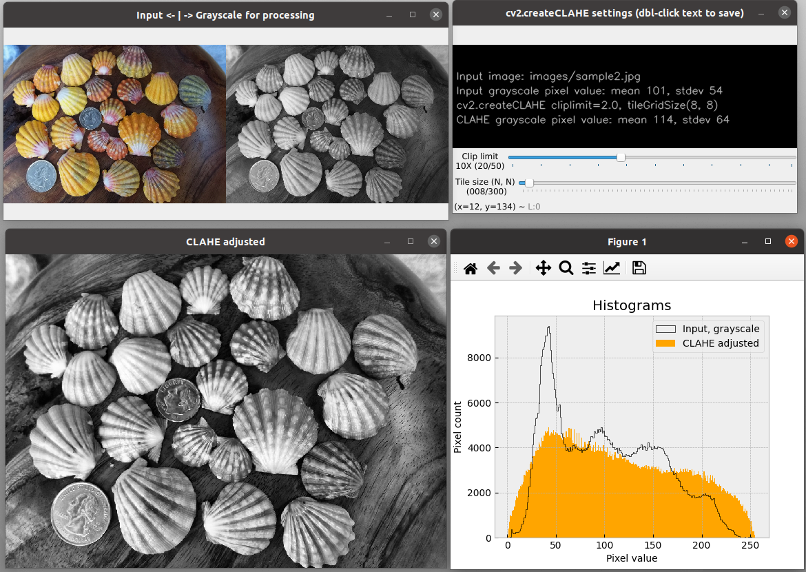

# Project: opencv-contour-util2

|  |  |
| ------------- | ------------- |

A Python program with a tkinter GUI to explore OpenCV parameters used to draw image object contours and identify specific shapes. A variety of parameter values can be adjusted using sliders, drop down menus, and button toggles (see figures below). Live image updates are displayed in multiple windows for each image processing step leading to object or shape detection.

The intention of this utility is to help OpenCV users understand the relevant parameters and value ranges needed to identify objects in their projects.

This is an upgrade of the original opencv-contour-utils repository that used the native OpenCV GUI and was suitable only for Linux systems. In the current implementation, opencv-contour-util2 can be run on Linux, Windows and macOS.

A utility is also provided to explore parameters for automatic histogram equalization.

All processing steps are conducted on grayscale conversions of the specified input file. A text file of chosen settings and the resulting image file of drawn contours, overlaid on the original image, can be saved. Image file samples are provided in the `images` folder: sample1.jpg (pills), sample2.jpg (shells), sample3.jpg (rummikub), sample4.jgp (shapes).

The default contour and shape outline color is green, but can be changed to yellow with the `--color yellow` command line argument. This may be useful for certain images or users with a color vision impairment.

Project inspired by code from Adrian Rosebrock:
https://pyimagesearch.com/2016/03/28/measuring-size-of-objects-in-an-image-with-opencv/

Development environment was Linux Ubuntu 20.04, macOS 13.2, and Windows11.

## contour_it.py
The module `contour_it.py` uses cv2.threshold and cv2.Canny for contour detection.
It uses cv2.approxPolyDP and cv2.HoughCircles for shape identification.
## equalize_it.py
The module `equalize_it.py` does not involve contours, but explores parameters for automatic histogram equalization as an optional pre-processing step for object detections. Unlike `contour_it.py`, it uses the native OpenCV GUI, not tkinter.

Equalization is by cv2.createCLAHE. CLAHE is a contrast-limited adaptive histogram equalization method. Live updates of the CLAHE histogram are controlled by slide bars for the clipLimit and tileGridSize parameter values. All processing is carried out on a grayscale version of the input file. The grayscale equalized image can be saved to use as input for `contour_it.py`. For most contour operations, however, the contrast and brightness controls provided in `contour_it.py` should be sufficient.

Be aware that CLAHE works best on images that have a full range of pixel values across the image, as in sample2.jpg (shells). In other words, it does not work well with images that have large areas of similar colors, as in sample1.jpg (pills), sample3.jpg (rummikub), or sample4.jpg (shapes). Nonetheless, this module can be fun to play with. Live histogram updating may be less responsive with larger image files.

A known issue is that, while `equalize_it.py` should work on all systems, some Linux installations may not show histograms. If that's the case, then try `equalize_tk.py` or `equalize_qt.py` found in https://github.com/csecht/opencv-contour-utility. The problem may be with the specific version of the required python packages.

### Usage examples:
From within the program's folder, use one of these Terminal or Command Prompt command formats, depending on your system. On Windows, replace 'python3' with 'python'.

Note that with no input argument, as in the first example, the default sample1.jpg from the `images` folder is used for input. Three sample input files are provided in the `images` folder.

       python3 -m contour_it

       python3 -m contour_it --input images/sample2.jpg

       python3 -m equalize_it -i images/sample2.jpg

List command line options, ex: `python3 -m contour_it --help`
       
       Explore Image Processing Parameters.
       optional arguments:
         -h, --help            show this help message and exit
         --about               Provide description, version, GNU license.
         --input PATH/FILE, -i PATH/FILE
                               Path to input image (PNG or JPG file).
         --scale X, -s X       Factor to change displayed image size (default: 1.0).
         --color C, -c C       CV contour color, C. (default: green; option: yellow).

Basic information, author, version, license, etc.: `python3 -m contour_it --about`
 
The Esc or Q key will quit any running module (except if "Histograms" window in `equalize_it.py` is currently selected; then just select one of the other windows to use a Quit key). From the command line, the usual Ctrl-C will also exit a module.

Images that are too large to fit on the screen can have their display size adjusted with the `--scale` command line argument. All image processing is performed at the original image resolution.

Files provided as examples in the `images` folder:
* sample1.jpg (pills, 800x600 692 kB),
* sample2.jpg (shells, 1050x750, 438 kB),
* sample3.jpg (rummikub, 4032x3024, 2.94 MB)
* sample4.jpg (shapes, 1245x1532, 137 kB)

### Requirements:
Python 3.7 or later, plus the packages OpenCV and Numpy. Additionally, Matplotlib, and it's dependency Pillow, are needed only with
the `equalize_*.py` modules; tkinter (included with Python 3.7 and above) is required with `equalize_tk.py`.
This program was developed in Python 3.8.

For quick installation of the required Python PIP packages:
from the downloaded GitHub repository folder, run this command

    pip install -r requirements.txt

Alternative commands (system dependent):

    python3 -m pip install -r requirements.txt (Linux and macOS)
    py -m pip install -r requirements.txt (Windows)
    python -m pip install -r requirements.txt (Windows)

### Known Issues:
Waiting for user comments.

This isn't a program issue, but a potential source of confusion when using the example image, sample4.jpg (shapes). With the default settings, the white border around the black background will display a hexagon-shaped contour, which may be difficult to see, especially when using yellow --color option. Consequently, it will be counted as a hexagon shape unless, in main settings, it is not recognized as a selected contour by clicking the cv2.arcLength button instead of cv2.contourArea.

### Screenshots:
All screenshots are from an Ubuntu Linux platform. For Windows and macOS platforms, window and widget formats will be slightly different.

Opening window for settings report_contour and contour selectors for with the minimum invocation command line that uses default arguments: `python3 -m contour_it`.

All image windows for contour processing at default settings, using a scale factor of 0.3. Command line: `python3 -m contour_it  -i images/sample2.jpg -s 0.3`.

Additional windows that appear when the "Show Shapes windows" is clicked and settings adjusted to find hexagon shapes. Command line: `python3 -m contour_it  -i images/sample4.jpg -s 0.3 --color yellow`.

Histograms and CLAHE windows will live update with CLAHE parameter sliders.
Command line: `python3 -m equalize_it  -i images/sample2.jpg`

### Attributions

Source of sample1.jpg image file:
Adrian Rosebrock at https://pyimagesearch.com/2016/03/28/measuring-size-of-objects-in-an-image-with-opencv/

Source of sample2.jpg image file:
http://sunrisekauai.blogspot.com/2012/06/new-group-of-sunrise-shells.html

All other image files are from the author, C.S. Echt.
