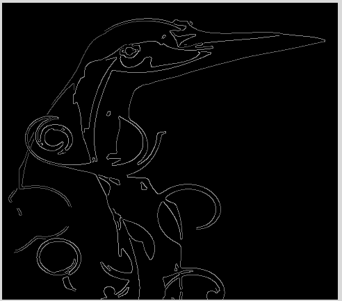
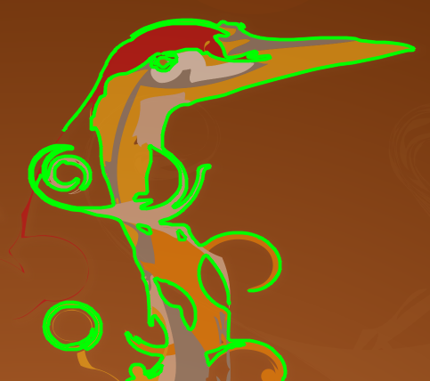
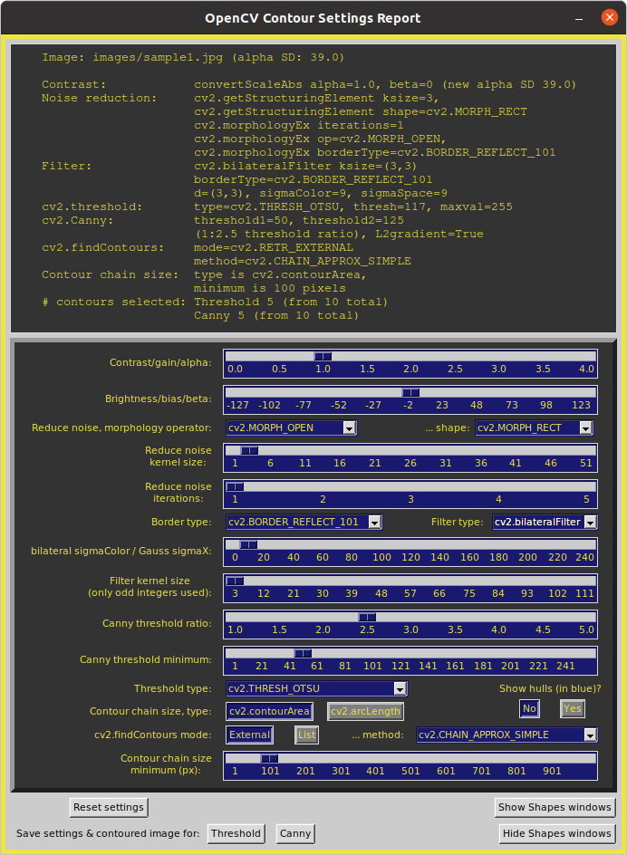
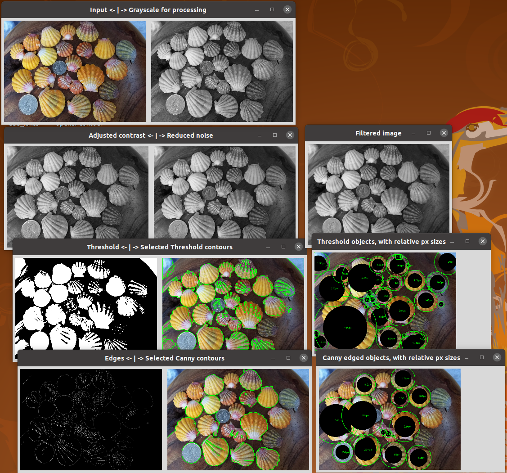
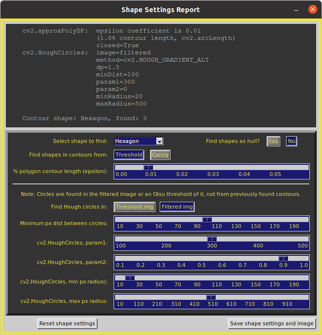
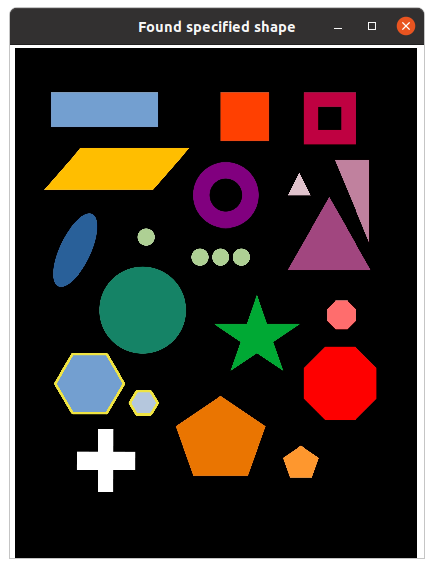
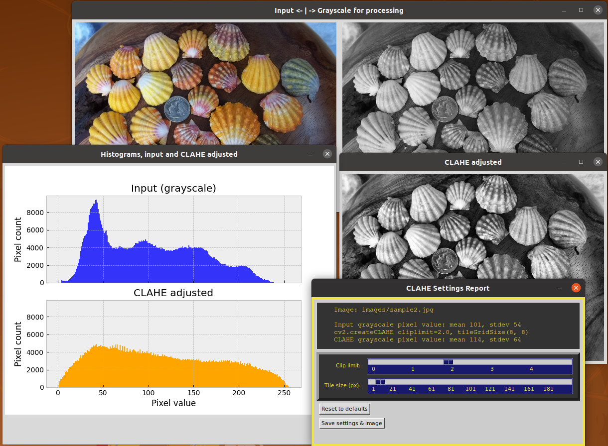
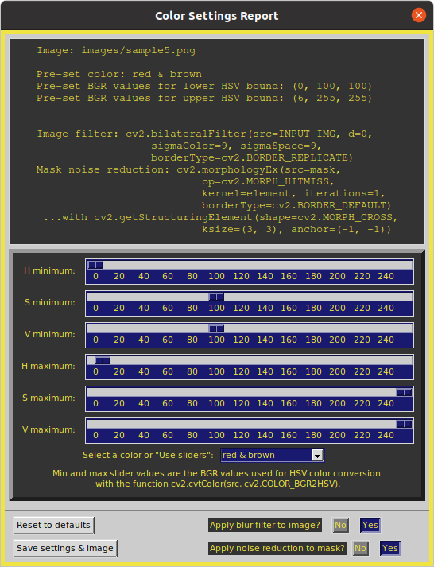

# Project: opencv-contour-util2

|  |  |
| ------------- | ------------- |

A set of Python programs that use a tkinter GUI to explore many OpenCV parameters to draw image contours and identify objects, find specific shapes, or mask colors. Parameter values can be selected using slider bars, drop down menus, and button toggles (see screenshots, below). Multiple windows are opened that display live updates as individual parameters change for each image processing step involved in object or shape detection.

The intention of this utility is to help OpenCV users understand the relevant parameters and their value ranges that may be needed to find contours, and identify objects, shapes, and colors.

Programs that run from the command line: 
* `contour_it.py` draws contours based on edges, thresholds, or shapes.
* `equalize_it.py` does CLAHE histogram equalization.
* `color_it.py` finds colors.
All can be run on Linux, Windows, and macOS platforms. `contour_it.py` is an upgrade of the original module found in the opencv-contour-utils repository that uses the native OpenCV GUI, but only for Linux systems.

All contour processing steps are conducted on grayscale conversions of the specified input file. A text file of chosen settings and the resulting image file of drawn contours, overlaid on the original image, can be saved. Image file samples, listed below, are provided in the `images` folder.

The default `contour_it.py` color for outlining objects is green, but can be changed to yellow with the `--color yellow` command line argument. This may be useful for certain images or users with a green color vision impairment.

Project inspired by code from Adrian Rosebrock:
https://pyimagesearch.com/2016/03/28/measuring-size-of-objects-in-an-image-with-opencv/

Development environment was Linux Ubuntu 20.04, macOS 13.2, and Windows11.

## contour_it.py
The module `contour_it.py` uses cv2.threshold and cv2.Canny for contour detection.
It uses cv2.approxPolyDP and cv2.HoughCircles for shape identification. See the startup window screenshot, below, for all cv2 functions and parameters used.

## equalize_it.py
The module `equalize_it.py` does not involve contours, but explores parameters for automatic histogram equalization. It can be used as an optional pre-processing step for contour detection. Equalization is by CLAHE, a contrast-limited adaptive histogram equalization method. Live updates of the CLAHE histogram are controlled by slide bars for the clipLimit and tileGridSize parameters of cv2.createCLAHE. All processing is carried out on a grayscale of the input file. The grayscale equalized image can be saved to use as input for `equalize_it.py`. For most contour needs, however, the contrast and brightness controls in `equalize_it.py` should be sufficient.

Be aware that CLAHE works best on images that have a more-or-less continuous range of pixel values across the image, as in sample2.jpg (shells). Hence, it does not work well with images that have large areas of similar colors, as in sample1.jpg (pills), sample3.jpg (rummikub), or sample4.jgp (shapes). Nonetheless, this module can be fun to play with. Live histogram updating may be less responsive with larger image files.

Note that the `--color` command line argument does nothing with `equalize_it.py`.

## color_it.py
The module `equalize_it.py` does not involve contours, but explores HSV colorspace for finding specific colors using cv2.COLOR_BGR2HSV; masking is performed with cv2.inRange and cv2.bitwise_and methods. HSV color boundaries are set with two sets of three slide bars for the upper and lower bounds. The sliders use a 0-255 scale of BGR values to be converted to HSV colorspace (screenshot below). There is also a pull-down menu of pre-selected colors. The color can be used as a starting point for subsequent optimization for your specific images. Selected values and the resulting color-masked image can be saved.

There are button toggles to apply or remove a blurring filter for the input image and noise reduction for the color mask. These operations, while adjustable in `contour_it.py`, are hard-coded here, but generally work well for color masking. The hard-coded parameter values used are listed in the report window.

Note that the `--color` command line argument does nothing with `color_it.py`.

### Usage examples:
From within the program's folder, example command line invocations:

       python3 -m contour_it  (uses a default input image)

       python3 -m contour_it --input images/sample2.jpg

       python3 -m contour_it -i /home/me/Desktop/myphoto.jpg --scale 0.2

       python3 -m equalize_it --i images/sample2.jpg -s 0.5

Note that with no input argument, as in the first example, the default sample1.jpg from the `images` folder is used for input. Three additional sample input files are provided in the `images` folder.
 On Windows systems, you may need to replace 'python3' with 'python' or 'py'.

Be aware that very large image file may require a few seconds to display the program widows, depending on your system performance. Be patient.

To list command line options: `python3 -m contour_it --help`
       
       Explore Image Processing Parameters.
       optional arguments:
         -h, --help            show this help message and exit
         --about               Provide description, version, GNU license.
         --input PATH/FILE, -i PATH/FILE
                               Path to input image (PNG or JPG file).
         --scale X, -s X       Factor, X, to change displayed image size (default: 1.0).
         --color C, -c C       cv2 contour color, C. (default: green; option: yellow).

To view basic information, author, version, license, etc.: `python3 -m contour_it --about`
 
The Esc or Q key will quit any running module.

Images that are too large to fit on the screen can have their display size adjusted with the `--scale` command line argument. All image processing is performed at the original image resolution.

Image file examples provided in the `images` folder:
* sample1.jpg (pills, 800x600 692 kB),
* sample2.jpg (shells, 1050x750, 438 kB),
* sample3.jpg (rummikub, 4032x3024, 2.94 MB)
* sample4.jpg (shapes, 1245x1532, 137 kB)
* sample5.png (X11 RGB color table, 1210x667, 497 kB)

### Requirements:
Python 3.7 or later, plus the packages OpenCV, Numpy and tkinter.

For quick installation of the required Python PIP packages:
from the downloaded GitHub repository folder, run this command

    pip install -r requirements.txt

Alternative commands (system dependent):

    python3 -m pip install -r requirements.txt (Linux and macOS)
    py -m pip install -r requirements.txt (Windows)
    python -m pip install -r requirements.txt (Windows)

As with all repository downloads, it is a good idea to install the requirements in a Python virtual environment to avoid undesired changes in your system's Python library.

### Screenshots:
All screenshots are from an Ubuntu Linux platform. For Windows and macOS platforms, window and widget look or layout may be slightly different.

Default startup window for contour parameter settings and reporting. Command line: `python3 -m contour_it`.

All image windows that open to display each image processing step. Initial window layout will depend on your system. Here, the windows were dragged into position to show them all without overlap. Command line: `python3 -m contour_it  -i images/sample2.jpg -s 0.3`.

The Shape windows appear when the "Show Shapes windows" is clicked. In this example, settings selected to find hexagon shapes. Command line: `python3 -m contour_it  -i images/sample4.jpg -s 0.3 --color yellow`.

The windows, manually rearranged, showing default settings for the two CLAHE parameters. Command line: `python3 -m equalize_it -i images/sample2.jpg -s 0.4`

The report and settings window for `color_it.py` at default settings. 
Command line: `python3 -m color_it -i images/sample5.png -s 0.5`

### Known Issues:

While `equalize_it.py` should work on all platforms, some Linux installations may not show the histograms. The problem may be with the specific version of the required Matplotlib packages.

While not a program issue, there is a potential source of confusion when using the example image, sample4.jpg (shapes). With the default settings, the white border around the black background will display a hexagon-shaped contour, which may be difficult to see, especially when using yellow --color option. Consequently, it will be counted as a hexagon shape unless, in main settings, it is not recognized as a selected contour by clicking the cv2.arcLength button instead of cv2.contourArea.

With `equalize_it.py` on Linux Ubuntu, moving the slider bar triggers updates only on button release, but updates are continuous with slide on Windows and macOS. The update-on-release feature is implemented to avoid annoying report text flickering.

### Attributions

Source of sample1.jpg image file:
Adrian Rosebrock at https://pyimagesearch.com/2016/03/28/measuring-size-of-objects-in-an-image-with-opencv/

Source of sample2.jpg image file:
http://sunrisekauai.blogspot.com/2012/06/new-group-of-sunrise-shells.html

All other image files are from the author, C.S. Echt. The sample5.png color table was generated by tk_color_helper.py from https://github.com/csecht/tkinter_utilities
